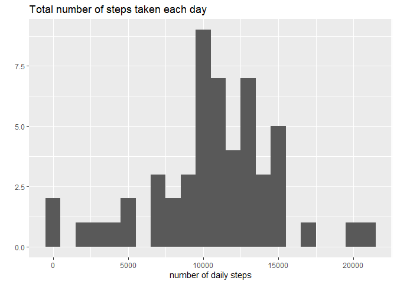
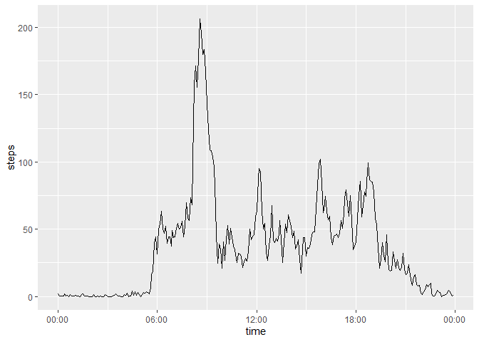
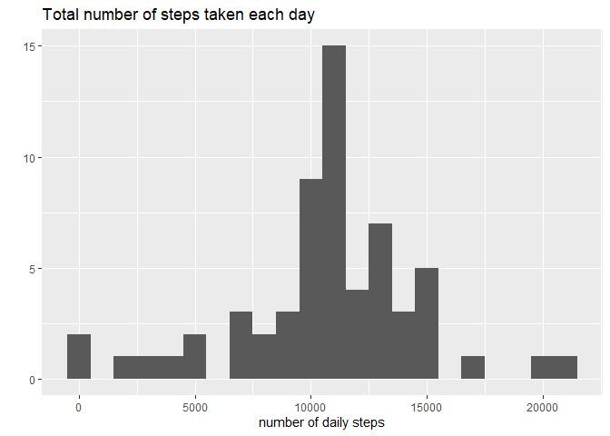
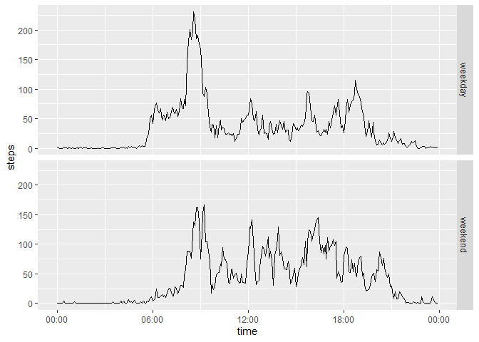

## Loading and preprocessing the data

```r
library(ggplot2)
library(dplyr)
```

```
## 
## Attaching package: 'dplyr'
```

```
## The following objects are masked from 'package:stats':
## 
##     filter, lag
```

```
## The following objects are masked from 'package:base':
## 
##     intersect, setdiff, setequal, union
```

```r
library(scales)
```
1. Load the data 

```r
unzip("activity.zip")
if (!exists("activity")){
  activity = read.csv("activity.csv")
}
```

2. Process/transform the data (if necessary) into a format suitable for your analysis

change the "interval" column to actual time of day.


```r
activity = mutate(activity, time=as.POSIXct(format(strptime(paste(interval%/%100, ":",interval%%100,":00",sep = ""),"%H:%M:%S"),"%H:%M"),format="%H:%M"))
```

## What is mean total number of steps taken per day?

-- creating a dailySteps dataframe by summing up all the steps data grouped by date (ignoring all the missing data NA)

```r
dailySteps = aggregate(steps ~ date, data = activity, sum)
```


1. Make a histogram of the total number of steps taken each day

```r
qplot(dailySteps$steps, 
      geom="histogram",
      binwidth = 1000,
      main = "Total number of steps taken each day",
      xlab = "number of daily steps")
```

<!-- -->

2. Calculate and report the mean and median total number of steps taken per day

```r
mean(dailySteps$steps)
```

```
## [1] 10766.19
```


```r
median(dailySteps$steps)
```

```
## [1] 10765
```

 The **mean** total number of steps per day: **10,766.19** steps
 <br />
 The **median** total number of steps per day: **10,765** steps


## What is the average daily activity pattern?

1. Make a time series plot (i.e. type = "l") of the 5-minute interval (x-axis) and the average number of steps taken, averaged across all days (y-axis)


```r
averageDailyPattern = aggregate(steps ~ time, data = activity, mean, rm.na=TRUE)

ggplot(data=averageDailyPattern, aes(x=time, y=steps)) + geom_line() + scale_x_datetime(labels = date_format("%H:%M",tz="Asia/Bangkok"))
```

<!-- -->

2. Which 5-minute interval, on average across all the days in the dataset, contains the maximum number of steps?


```r
format(averageDailyPattern$time[which.max(averageDailyPattern$steps)],"%H:%M")
```

```
## [1] "08:35"
```

The maximum number of steps occure at the 835 interval, that is at **08:35** in an average day.

## Imputing missing values

Note that there are a number of days/intervals where there are missing values (coded as NA). The presence of missing days may introduce bias into some calculations or summaries of the data.

1. Calculate and report the total number of missing values in the dataset (i.e. the total number of rows with NAs)


```r
sum(is.na(activity$steps))
```

```
## [1] 2304
```

The number of missing values in the dataset is **2,304**

<br />
<br />
 

2. Devise a strategy for filling in all of the missing values in the dataset. The strategy does not need to be sophisticated. For example, you could use the mean/median for that day, or the mean for that 5-minute interval, etc.


```r
fillInSteps <- function(t) {
    averageDailyPattern[averageDailyPattern$time == t, ]$steps
}
```

3. Create a new dataset that is equal to the original dataset but with the missing data filled in.


```r
activityNoNA = activity

check = 0  ## checking the number of NA replaced
for (i in 1:nrow(activityNoNA)) {
    if (is.na(activityNoNA[i, ]$steps)) {
        activityNoNA[i, ]$steps <- fillInSteps(activityNoNA[i, ]$time)
        check = check + 1
    }
}
```

New dataframe `activityNoNA` has been created with **2,304** NA's replaced with corresponding number of steps from averageDailyPattern

4. Make a histogram of the total number of steps taken each day and Calculate and report the mean and median total number of steps taken per day. Do these values differ from the estimates from the first part of the assignment? What is the impact of imputing missing data on the estimates of the total daily number of steps?


```r
dailyStepsNoNA = aggregate(steps ~ date, data = activityNoNA, sum)
```


```r
qplot(dailyStepsNoNA$steps, 
      geom="histogram",
      binwidth = 1000,
      main = "Total number of steps taken each day",
      xlab = "number of daily steps")
```

<!-- -->

2. Calculate and report the mean and median total number of steps taken per day

```r
mean(dailyStepsNoNA$steps)
```

```
## [1] 10766.19
```


```r
median(dailyStepsNoNA$steps)
```

```
## [1] 10766.19
```

 The **mean** total number of steps per day: **10,766.19** steps
 <br />
 The **median** total number of steps per day: **10,766.19** steps
 
 <br />
 <br />
 
After filling in the missing values, the mean hasn't changed from before, since we pretty much use the number of steps in an average day to fill the missing value. However the median increased slightly and is now equal to the mean.
 

## Are there differences in activity patterns between weekdays and weekends

For this part the weekdays() function may be of some help here. Use the dataset with the filled-in missing values for this part.

1. Create a new factor variable in the dataset with two levels -- "weekday" and "weekend" indicating whether a given date is a weekday or weekend day.


```r
activityNoNA$dayType = ifelse(weekdays(as.Date(activityNoNA$date)) %in% c("Saturday","Sunday"),"weekend","weekday")

activityNoNA$dayType = factor(activityNoNA$dayType, levels = c("weekday", "weekend"))
```

2. Make a panel plot containing a time series plot (i.e. type = "l") of the 5-minute interval (x-axis) and the average number of steps taken, averaged across all weekday days or weekend days (y-axis). The plot should look something like the following, which was created using simulated data:


```r
avgDailyPattern2 = aggregate(steps ~ time + dayType, activityNoNA, mean)

ggplot(data=avgDailyPattern2, aes(x=time, y=steps)) + geom_line() + scale_x_datetime(labels = date_format("%H:%M",tz="Asia/Bangkok")) + facet_grid(dayType ~ .)
```

<!-- -->

Weekdays seem to have higher number of steps in the morning and less throughout the day. Weekends seem to have more evenly spread out activities throughout the day.
